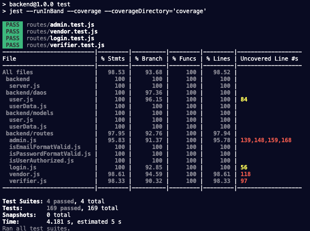

# uw-jscript330b-final-project

<a name="readme-top"></a>

<!-- TABLE OF CONTENTS -->
<details>
  <summary>Table of Contents</summary>
  <ol>
  <li>
      <a href="#final-project-update">Final Project Update</a>
      <ul>
        <li><a href="#approach">Approach</a></li>
        <li><a href="#results">Results</a></li>
        <li><a href="#learned">Learned</a></li>
        <li><a href="#improvements">Improvements</a></li>
        <li>
      <a href="#project-setup">Project Setup</a>
      <ul>
        <li><a href="#api-backend">API Backend</a></li>
        <li><a href="#frontend-sample">Frontend Sample</a></li>
      </ul>
    </li>
      </ul>
    </li>
    <li>
      <a href="#project-update">Project Update</a>
      <ul>
        <li><a href="#completed">Completed</a></li>
        <li><a href="#pending">Pending</a></li>
      </ul>
    </li>
    <li>
      <a href="#about-the-project">About The Project</a>
      <ul>
        <li><a href="#scenario">Scenario</a></li>
        <li><a href="#problem">Problem</a></li>
      </ul>
    </li>
    <li>
      <a href="#components">Components</a>
      <ul>
        <li><a href="#external-components">External Components</a></li>
      </ul>
      <ul>
        <li><a href="#routes">Routes</a></li>
      </ul>
      <ul>
        <li><a href="#data-models">Data Models</a></li>
      </ul>
    </li>
    <li>
      <a href="#plan">Plan</a>
      <ul>
        <li><a href="#sequence-diagram">Sequence Diagram</a></li>
      </ul>
      <ul>
        <li><a href="#authorization-and-authentication">Authorization and Authentication</a></li>
      </ul>
      <ul>
        <li><a href="#create-routes">Create routes</a></li>
      </ul>
       <ul>
        <li><a href="#read-routes">Read routes</a></li>
      </ul>
       <ul>
        <li><a href="#update-routes">Update routes</a></li>
      </ul>
      <ul>
        <li><a href="#delete-routes">Delete routes</a></li>
      </ul>
    </li>
    <li><a href="#timeline">Timeline</a></li>
  </ol>
</details>
<br/>

<!-- FINAL UPDATE -->

## Final Project Update

> (06/17/23)

### Self-Evaluation

#### Approach

> I was introduced to test-driven development in the last frontend course but I did not get to apply it as much as I had in this project which is something I'm very proud to have completed. Being able to work through weekly assignments that prioritized learning how to code with unit tests was valuable to me. In my previous roles outside of software development, I'm always someone who puts more thought into a plan before tackling problems. Even with the use of mermaid diagrams which was something I recently learned about to help visually plan the flow of an application, by writing unit tests, it allowed me stay on organized throughout the project as I worked on various sections of my code. Unit tests also ensured areas of my code that were dependent on an updated section were always put into my attention.

#### Results

> Overall I'm satisfied with what I was able to accomplish in this project from completing over 90% test coverage, completing all CRUD requirements, applying authentication, and finding an area to apply some advance mongoDB methods such as an aggregation with multiple pipeline stages. I'm glad to have deployed the backend and setup mongo atlas as we had learned in class. Additionally I'm also glad to have created a sample frontend to tie this whole program together into this project.

- Deployed API/Backend: https://uw-jscript330b-final-project-production.up.railway.app
- Test Results:

  

- Dependencies
  - Express/Node.js
  - Mongoose/MongoDB Atlas
  - bcrypt
  - JWT
  - Jest

<p align="right">(<a href="#readme-top">back to top</a>)</p>

- Project Structure - API/Backend

  ```
  ├── apis
  │   └── zkTestAPI.js
  ├── daos
  │   ├── user.js
  │   └── userData.js
  ├── index.js
  ├── jest-mongodb-config.js
  ├── models
  │   ├── user.js
  │   └── userData.js
  ├── package-lock.json
  ├── package.json
  ├── routes
  │   ├── admin.js
  │   ├── admin.test.js
  │   ├── index.js
  │   ├── isEmailFormatValid.js
  │   ├── isPasswordFormatValid.js
  │   ├── isUserAuthorized.js
  │   ├── login.js
  │   ├── login.test.js
  │   ├── vendor.js
  │   ├── vendor.test.js
  │   ├── verifier.js
  │   └── verifier.test.js
  ├── server.js
  └── test-utils.js
  ```

#### Learned

> This final project went very well with minimal issues completing the requirements. In comparison to my frontend project from the last course which I did have a well thought plan of the design, however the impact from having a significantly lesser amount of unit tests made the experience felt disorganized. This has been a great experience to see the value of prioritizing a test driven development approach earlier and throughout a project. Even my knowledge of creating unit tests has greatly improved when compared to only fixing code based on prebuilt tests during the weekly class assignments. I have a greater understanding of Express, Node.js, and MongoDB after successfully creating this project. Also coming into the course I had my mind on learning more about CORS as it was an issue I did not resolve in my last frontend project. With the knowledge I now have with creating APIs, I was able to play with CORS settings and learn about the errors while adding a sample frontend. Lastly, learned about a new frontend build tool called Vite after finding out that the Create React App tool which was highly utilized in the last course was no longer being maintained. In summary, I have learned a great amount of knowledge during this backend course and the overall full-stack program to continue building fun applications.

#### Improvements

- Find ways to refactor code.
- Work with a large dataset.
- Integrate actual external components.
- Update the frontend to apply all routes.
- Obtain 100% coverage.

### Project Setup

#### API Backend

- Server Deployed: https://uw-jscript330b-final-project-production.up.railway.app
- For local setup, in root project directory:

  `cd backend && npm install`

  `npm start`

- API will be accessible via http://localhost:3000/

#### Frontend Sample

- In root project directory:

  `cd frontend-vite && npm install`

  `npm run dev`

- App will be accessible via http://localhost:3001/
- Fetch routes will need to be updated if running backend locally

<p align="right">(<a href="#readme-top">back to top</a>)</p>
<!-- PROJECT UPDATE -->

## Project Update

> (06/04/23)

### Completed

- Login/authorization functions and tests.
- Data models for user and userData collections.
- All create, read, and update route/DAO functions related to an admin user.
- Tests related to above functions.
- Postman related to above tests saved.
- All other tests have been setup with descriptions for each 'describe' and 'it' blocks.

### Pending

- Delete functions and tests related to admin user.
- Vendor and Verifier user functions and tests. Majority of code will follow admin related functions.
- Setting up mocks for external components
- Remaining Postman items for demo
- Presentation

<br>

<!-- ABOUT THE PROJECT -->

## About The Project

### Scenario

> This project serves to provide the back-end and database components for a Vendor Credentialing (VC) application for use in the Healthcare service industry. All vendors that perform work at a hospital or clinic are required to be fully compliant on any credentialing requirements. Most hospital network outsources this process to a third-party VC company. A hospital network will provide a list of requirements to the third-party VC company to manage the data collection and authorization of vendors to access a facility (i.e. data can include identification, background screening, completed training materials, and medical records).

### Problem

> Third-party data leaks are a common occurrence and one that continues to rise in healthcare <a href="https://www.techtarget.com/searchsecurity/news/252521771/Healthcare-breaches-on-the-rise" target="_blank">June 2022</a>. A way to reduce the issue is to minimize the number of instances personal information are uploaded to databases. A pain point in the industry is having to upload the same personal documents to multiple vendor credentialing companies when access to multiple hospitals are needed. The process creates additional administrative costs and increases attack vectors that leads to personal data leaks. By applying the principals of a zero-knowledge protocol, zero information from a personal record will be shared to vendor credential companies but still allow for credentials to become verified. Solving this problem in the vendor credentialing process could also lead to the adoption of zero-knowledge protocols deeper in the healthcare industry to improve the security of sharing and tracking electronic medical records.

<p align="right">(<a href="#readme-top">back to top</a>)</p>

### Components

<!-- 3. A description of what the technical components of your project will be, including: the routes, the data models, any external data sources you'll use, etc. -->

#### External Components:

- Two external components will be simulated in this project. An Electronic data verification system (a component to authenticate input data) and a Zero-knowledge component (produces the zk proof).

#### Routes:

- Login

  - A user will be required to login with an username/password to obtain a JWT token. This route will deny access if required inputs are not received in a request.

- Middleware

  - A request that holds a Bearer token will be validated before accessing subsequent functions. Token expiration will occur after 15 mins which a new token will be generated for any activity within the the last 5 mins of the 15 min window. (Timing will be simulated during demo)

- Create

  - An Admin will only have the access to create a new user with an assigned role. A new document will be created in the User collection DB. Invalid inputs will be rejected.
  - Only Vendor users will be able to upload an electronic version of a personal record. The record will be authenticated through a simulated Electronic data verification system before passed into the ZK component to generate a ZK proof. All necessary data required for the zk system to function is saved into the User_Data collection DB.
    - The uploading of an electronic personal record will be simulated through a simple data object in the request body.

- Read data

  - Admins will be able to retrieve data for any userId in the User collection. Admins will have a route to retrieve all userIds by a group ID. No access to the User_Data collection is permitted.
  - Admins will be able to search records relating to a user's name, email, phone and retrieve a limit of 5 documents based on input.
  - A vendor user will be able to view data matching to their userId from both the User and User_Data collections.
  - Verifiers will have access to read data matching it's userId from the User collection. Verifiers also have a route to perform a zero knowledge verification. This will require that the verifier has a role that allows for verifications of specific data on vendor users.

- Updating data

  - Admins will have access to update limited data fields to email, phone, and password.
  - Vendor and Verifier users will have access to update their own email, phone, and password data.
  - Vendor users will be able to upload an electronic version of a personal record to update an existing record. The record will be authenticated through a simulated Electronic data verification system before passed into the ZK component to generate a ZK proof. All necessary data required for the zk system to function is saved into the User_Data collection DB.
    - Similar to the create function, the uploading of an electronic personal record will be simulated through a simple data object in the request body.

- Deleting data
  - Admins are allowed to delete a user and all data in both User and User_Data collections by userId. Vendor and Verifier users will not have access to this feature.
  - Vendor user are able to delete a personal record by a personal record ID

#### Data models:

- User \* Fields include a User ID, Name, Email, Phone, Password, vendorGroupId, and verifierGroupId
  - Index will be used on the name, email, and phone fields.
- User_Data - Fields will include a User ID, array of personal data (Project example: personalRecord01, ..., personalRecordN), and a zkProof string
  - Aggregate and Lookup methods will be used to connect the User and User_Data collections and display requesting documents to a Vendor user.
- zkTransactions (TBD - This portion may not be included in project or a simple model will be use for demo) \* All zk related data
  - In any route that utilizes zk transactions, a transaction record will be saved to the User_zkTransactions collection containing data related to the zk changes. This will allow for a zk recursion feature if implemented in the project. A purpose of this feature could be utilized for audit scenarios requiring detailed external recreation of zk proofs. During any updates to a vendor user's User_Data, the old zk proof can be used as an input field to generate a new zk proof. This will allow for faster verifications at any point in time when evaluating a timeline of changes in the User personal data.

<p align="right">(<a href="#readme-top">back to top</a>)</p>

### Plan

- Project will be completed following the flow of the sequence diagram.

#### Sequence Diagram (View below for parts of sequence)

```mermaid
sequenceDiagram
%%{init: {'theme':'dark'}}%%

box Authorization
participant User
participant (Route) Login
participant (DAO) Create/Update JWT token
participant (Middleware) Validate User
end

box Routes (After Login)
participant (Route) Create New User
participant (Route) Create New Personal record
participant (Route) Read Only Data
participant (Route) Verify ZK proof
participant (Route) Update User
participant (Route) Update User Data
participant (Route) Delete User
participant (Route) Delete User Data
end

box External Components
participant (External) Electronic data verification system
participant (External) Zero-Knowledge component
end

box Mongo DB
participant MongoDB_User
participant MongoDB_User_Data
participant MongoDB_User_zkTransactions
end

%% Any User logs in
rect rgb(0, 102, 51)
User ->> (Route) Login: Sends request to Login with email/password
(Route) Login ->> MongoDB_User: Retrieve user data and encrypted password
MongoDB_User -->> (Route) Login: Confirms with data + Success/Fail
(Route) Login ->> (DAO) Create/Update JWT token: Validates login with bcrypt and request a new JWT Token
(DAO) Create/Update JWT token -->> (Route) Login: Generates new JWT Token with UserId with a timed token expiration
(Route) Login -->> User: Response - JWT token
(Route) Login -->> User: Response - Error not authorized
end

%% Any logged in user requests
rect rgb(18, 65, 195)
User ->> (Middleware) Validate User: All requests require a valid token
(Middleware) Validate User -->> (DAO) Create/Update JWT token: Update JWT if near time expiration
(DAO) Create/Update JWT token ->> (Middleware) Validate User: Response - JWT token or error
(Middleware) Validate User -->> User: Response - Error invalid token
end

%% Admin creates a new User
rect rgb(0, 128, 255)
(Middleware) Validate User ->> (Route) Create New User: (Admin) - Create a new User (i.e. name, email, phone, tempPassword, vendorGroupId, verifierGroupId)
(Route) Create New User ->>(External) Electronic data verification system: Perform an external validation on user data
(External) Electronic data verification system -->> (Route) Create New User: Invalid User data
(External) Electronic data verification system ->> MongoDB_User: Save User data + unique user _id
MongoDB_User -->> (Route) Create New User: Confirms with Success/Fail
(Route) Create New User -->> User: Response - Success/Fail
end

%% Admin views a User record by userId or a limited query results from text search
rect rgb(0, 128, 255)
(Middleware) Validate User ->> (Route) Read Only Data: (Admin) - View a User by userId or a text search
(Route) Read Only Data ->> MongoDB_User: Verify Admin role and retrieve a matching User document or a limited query results from text search
MongoDB_User -->> (Route) Read Only Data: Confirms with data + Success/Fail
(Route) Read Only Data -->> User: Response - Data + Success/Fail
end

%% Admin views a list of userIds for a specific Vendor or Verifier group
rect rgb(0, 128, 255)
(Middleware) Validate User ->> (Route) Read Only Data: (Admin) - View a list of userIds by vendorGroupId or verifierGroupId
(Route) Read Only Data ->> MongoDB_User: Verify Admin role and retrieve userIds matching query
MongoDB_User -->> (Route) Read Only Data: Confirms with data + Success/Fail
(Route) Read Only Data -->> User: Response - Data + Success/Fail
end

%% Admin updates own user data (Limited to email, phone, password)
rect rgb(0, 128, 255)
(Middleware) Validate User ->> (Route) Update User: (Admin) - Update a Admin User's own data
(Route) Update User ->> MongoDB_User: Verify Admin role and update limited to email, phone, password
MongoDB_User -->> (Route) Update User: Confirms with Success/Fail
(Route) Update User -->> User: Response - Success/Fail
end

%% Admin deletes a User record
rect rgb(0, 128, 255)
(Middleware) Validate User ->> (Route) Delete User: (Admin) - Delete a user document by userId
(Route) Delete User ->> MongoDB_User: Lookup by userId and delete document in User collection DB
MongoDB_User -->> (Route) Delete User: Confirms with Success/Fail
(Route) Delete User ->> MongoDB_User_Data: Lookup all personal records matching userId and delete documents in User_Data collection DB
MongoDB_User_Data -->> (Route) Delete User: Confirms with Success/Fail
(Route) Delete User -->> User: Response - Success/Fail
end

%% A Vendor user creates a new personal record
rect rgb(127, 0, 255)
(Middleware) Validate User ->> (Route) Create New Personal record: (Vendor) - Create a new personal record in User_Data with a reference to a vendor userId
(Route) Create New Personal record ->> (External) Electronic data verification system: Perform an external validation on personal data
(External) Electronic data verification system -->> (Route) Create New Personal record: Confirms with Success/Fail
(External) Electronic data verification system ->> (External) Zero-Knowledge component: Approved personal data feeds into ZKP system to generate a ZK proof
(External) Zero-Knowledge component -->> (Route) Create New Personal record: Confirms with Success/Fail
(External) Zero-Knowledge component ->> MongoDB_User_Data: Create unique id + save personal data + userId + dataType + Merkle Tree + ZK Proof_Root
MongoDB_User_Data -->> (Route) Create New Personal record: Confirms with Success/Fail
(External) Zero-Knowledge component ->> MongoDB_User_zkTransactions: Record changes + userId + dataType + Merkle Tree + ZK Proof_Root + date/time
MongoDB_User_zkTransactions -->> (Route) Create New Personal record: Confirms with Success/Fail
(Route) Create New Personal record -->> User: Response - Success/Fail
end

%% A Vendor User views personal records
rect rgb(127, 0, 255)
(Middleware) Validate User ->> (Route) Read Only Data: (Vendor) - View a Vendor User's own personal records by ID or text search
(Route) Read Only Data ->> MongoDB_User_Data: Verify Vendor role and retrieve a matching User document or a limited query result
MongoDB_User_Data -->> (Route) Read Only Data: Confirms with data + Success/Fail
(Route) Read Only Data -->> User: Response - Data + Success/Fail
end

%% A Vendor User updates own user data (Limited to email, phone, password)
rect rgb(127, 0, 255)
(Middleware) Validate User ->> (Route) Update User: (Vendor) - Update a Vendor User's own data
(Route) Update User ->> MongoDB_User: Verify Vendor role and update limited to email, phone, password
MongoDB_User -->> (Route) Update User: Confirms with Success/Fail
(Route) Update User -->> User: Response - Success/Fail
end

%% A Vendor User uploads a personal record to update an existing record based on a record ID
rect rgb(127, 0, 255)
(Middleware) Validate User ->> (Route) Update User Data: (Vendor) - Uploads an electronic personal record with a reference an existing record ID
(Route) Update User Data ->> (External) Electronic data verification system: Perform an external validation on personal data
(External) Electronic data verification system -->> (Route) Update User Data: Confirms with Success/Fail
(External) Electronic data verification system ->> (External) Zero-Knowledge component: Approved personal data feeds into ZKP system to generate a ZK proof
(External) Zero-Knowledge component -->> (Route) Update User Data: Confirms with Success/Fail
(External) Zero-Knowledge component ->> MongoDB_User_Data: Uses current unique id + save personal data + userId + dataType + Merkle Tree + ZK Proof_Root
MongoDB_User_Data -->> (Route) Update User Data: Confirms with Success/Fail
(External) Zero-Knowledge component ->> MongoDB_User_zkTransactions: Record changes + userId + dataType + Merkle Tree + ZK Proof_Root + date/time
MongoDB_User_zkTransactions -->> (Route) Update User Data: Confirms with Success/Fail
(Route) Update User Data -->> User: Response - Success/Fail
end

%% A Vendor User deletes a personal record
rect rgb(127, 0, 255)
(Middleware) Validate User ->> (Route) Delete User Data: (Vendor) - Deletes a personal record
(Route) Delete User Data ->> (External) Electronic data verification system: Perform an external validation on personal data
(External) Electronic data verification system -->> (Route) Delete User Data: Confirms with Success/Fail
(External) Electronic data verification system ->> (External) Zero-Knowledge component: Approved personal data feeds into ZKP system to generate a ZK proof
(External) Zero-Knowledge component -->> (Route) Delete User Data: Confirms with Success/Fail
(Route) Delete User Data ->> MongoDB_User_Data: Verify Vendor role and delete personal record by id
MongoDB_User_Data -->> (Route) Delete User Data: Confirms with updated data + Success/Fail
(Route) Delete User Data ->> (External) Zero-Knowledge component: Feed updated data into ZKP system to generate a ZK proof
(External) Zero-Knowledge component -->> (Route) Delete User Data: Confirms with Success/Fail
(External) Zero-Knowledge component ->> MongoDB_User_Data: Save updated personal data + userId + dataType + Merkle Tree + ZK Proof_Root
MongoDB_User_Data -->> (Route) Delete User Data: Confirms with Success/Fail
(External) Zero-Knowledge component ->> MongoDB_User_zkTransactions: Record changes + userId + dataType + Merkle Tree + ZK Proof_Root + date/time
MongoDB_User_zkTransactions -->> (Route) Delete User Data: Confirms with Success/Fail
(Route) Delete User Data -->> User: Response - Success/Fail
end

%% A Verifier User views own user data
rect rgb(76, 0, 153)
(Middleware) Validate User ->> (Route) Read Only Data: (Verifier) - View a Verifier User's own data
(Route) Read Only Data ->> MongoDB_User: Verify Verifier role and retrieve a matching User document
MongoDB_User -->> (Route) Read Only Data: Confirms with data + Success/Fail
(Route) Read Only Data -->> User: Response - Data + Success/Fail
end

%% A Verifier User updates own user data (Limited to email, phone, password)
rect rgb(76, 0, 153)
(Middleware) Validate User ->> (Route) Update User: (Verifier) - Update a Verifier User's own data
(Route) Update User ->> MongoDB_User: Verify Verifier role and update limited to email, phone, password
MongoDB_User -->> (Route) Update User: Confirms with Success/Fail
(Route) Update User -->> User: Response - Success/Fail
end

%% A Verifier validates ZK proof of a userId
rect rgb(76, 0, 153)
(Middleware) Validate User ->> (Route) Verify ZK proof: (Verifier) - Validate a ZK proof of a Vendor User personal data
(Route) Verify ZK proof ->> MongoDB_User: Verify Verifier role
MongoDB_User ->> (Route) Verify ZK proof: Confirms + Success/Fail
(Route) Verify ZK proof ->> (External) Zero-Knowledge component: Submit input data from verifier
(External) Zero-Knowledge component -->> (Route) Verify ZK proof: Confirms with Verified/Not Verified/Fail
(Route) Verify ZK proof -->> User: Response - Verified/Not Verified/Fail
end
```

##### Authorization and Authentication

```mermaid
sequenceDiagram
%%{init: {'theme':'dark'}}%%

box Authorization
participant User
participant (Route) Login
participant (DAO) Create/Update JWT token
participant (Middleware) Validate User
end

box Mongo DB
participant MongoDB_User
end

%% Any User logs in
rect rgb(0, 102, 51)
User ->> (Route) Login: Sends request to Login with email/password
(Route) Login ->> MongoDB_User: Retrieve user data and encrypted password
MongoDB_User -->> (Route) Login: Confirms with data + Success/Fail
(Route) Login ->> (DAO) Create/Update JWT token: Validates login with bcrypt and request a new JWT Token
(DAO) Create/Update JWT token -->> (Route) Login: Generates new JWT Token with UserId with a timed token expiration
(Route) Login -->> User: Response - JWT token
(Route) Login -->> User: Response - Error not authorized
end

%% Any logged in user requests
rect rgb(18, 65, 195)
User ->> (Middleware) Validate User: All requests require a valid token
(Middleware) Validate User -->> (DAO) Create/Update JWT token: Update JWT if near time expiration
(DAO) Create/Update JWT token ->> (Middleware) Validate User: Response - JWT token or error
(Middleware) Validate User -->> User: Response - Error invalid token
end
```

##### Create routes

```mermaid
sequenceDiagram
%%{init: {'theme':'dark'}}%%

box Authorization
participant User
participant (DAO) Create/Update JWT token
participant (Middleware) Validate User
end

box Routes (After Login)
participant (Route) Create New User
participant (Route) Create New Personal record
end

box External Components
participant (External) Electronic data verification system
participant (External) Zero-Knowledge component
end

box Mongo DB
participant MongoDB_User
participant MongoDB_User_Data
participant MongoDB_User_zkTransactions
end

%% Any logged in user requests
rect rgb(18, 65, 195)
User ->> (Middleware) Validate User: All requests require a valid token
(Middleware) Validate User -->> (DAO) Create/Update JWT token: Update JWT if near time expiration
(DAO) Create/Update JWT token ->> (Middleware) Validate User: Response - JWT token or error
(Middleware) Validate User -->> User: Response - Error invalid token
end

%% Admin creates a new User
rect rgb(0, 128, 255)
(Middleware) Validate User ->> (Route) Create New User: (Admin) - Create a new User (i.e. name, email, phone, tempPassword, vendorGroupId, verifierGroupId)
(Route) Create New User ->>(External) Electronic data verification system: Perform an external validation on user data
(External) Electronic data verification system -->> (Route) Create New User: Invalid User data
(External) Electronic data verification system ->> MongoDB_User: Save User data + unique user _id
MongoDB_User -->> (Route) Create New User: Confirms with Success/Fail
(Route) Create New User -->> User: Response - Success/Fail
end

%% A Vendor user creates a new personal record
rect rgb(127, 0, 255)
(Middleware) Validate User ->> (Route) Create New Personal record: (Vendor) - Create a new personal record in User_Data with a reference to a vendor userId
(Route) Create New Personal record ->> (External) Electronic data verification system: Perform an external validation on personal data
(External) Electronic data verification system -->> (Route) Create New Personal record: Confirms with Success/Fail
(External) Electronic data verification system ->> (External) Zero-Knowledge component: Approved personal data feeds into ZKP system to generate a ZK proof
(External) Zero-Knowledge component -->> (Route) Create New Personal record: Confirms with Success/Fail
(External) Zero-Knowledge component ->> MongoDB_User_Data: Create unique id + save personal data + userId + dataType + Merkle Tree + ZK Proof_Root
MongoDB_User_Data -->> (Route) Create New Personal record: Confirms with Success/Fail
(External) Zero-Knowledge component ->> MongoDB_User_zkTransactions: Record changes + userId + dataType + Merkle Tree + ZK Proof_Root + date/time
MongoDB_User_zkTransactions -->> (Route) Create New Personal record: Confirms with Success/Fail
(Route) Create New Personal record -->> User: Response - Success/Fail
end
```

<p align="right">(<a href="#readme-top">back to top</a>)</p>

##### Read routes

```mermaid
sequenceDiagram
%%{init: {'theme':'dark'}}%%

box Authorization
participant User
participant (DAO) Create/Update JWT token
participant (Middleware) Validate User
end

box Routes (After Login)
participant (Route) Read Only Data
participant (Route) Verify ZK proof
end

box External Components
participant (External) Zero-Knowledge component
end

box Mongo DB
participant MongoDB_User
participant MongoDB_User_Data
end

%% Any logged in user requests
rect rgb(18, 65, 195)
User ->> (Middleware) Validate User: All requests require a valid token
(Middleware) Validate User -->> (DAO) Create/Update JWT token: Update JWT if near time expiration
(DAO) Create/Update JWT token ->> (Middleware) Validate User: Response - JWT token or error
(Middleware) Validate User -->> User: Response - Error invalid token
end

%% Admin views a User record by userId or a limited query results from text search
rect rgb(0, 128, 255)
(Middleware) Validate User ->> (Route) Read Only Data: (Admin) - View a User by userId or a text search
(Route) Read Only Data ->> MongoDB_User: Verify Admin role and retrieve a matching User document or a limited query results from text search
MongoDB_User -->> (Route) Read Only Data: Confirms with data + Success/Fail
(Route) Read Only Data -->> User: Response - Data + Success/Fail
end

%% Admin views a list of userIds for a specific Vendor or Verifier group
rect rgb(0, 128, 255)
(Middleware) Validate User ->> (Route) Read Only Data: (Admin) - View a list of userIds by vendorGroupId or verifierGroupId
(Route) Read Only Data ->> MongoDB_User: Verify Admin role and retrieve userIds matching query
MongoDB_User -->> (Route) Read Only Data: Confirms with data + Success/Fail
(Route) Read Only Data -->> User: Response - Data + Success/Fail
end

%% A Vendor User views personal records
rect rgb(127, 0, 255)
(Middleware) Validate User ->> (Route) Read Only Data: (Vendor) - View a Vendor User's own personal records by ID or text search
(Route) Read Only Data ->> MongoDB_User_Data: Verify Vendor role and retrieve a matching User document or a limited query result
MongoDB_User_Data -->> (Route) Read Only Data: Confirms with data + Success/Fail
(Route) Read Only Data -->> User: Response - Data + Success/Fail
end

%% A Verifier User views own user data
rect rgb(76, 0, 153)
(Middleware) Validate User ->> (Route) Read Only Data: (Verifier) - View a Verifier User's own data
(Route) Read Only Data ->> MongoDB_User: Verify Verifier role and retrieve a matching User document
MongoDB_User -->> (Route) Read Only Data: Confirms with data + Success/Fail
(Route) Read Only Data -->> User: Response - Data + Success/Fail
end

%% A Verifier validates ZK proof of a userId
rect rgb(76, 0, 153)
(Middleware) Validate User ->> (Route) Verify ZK proof: (Verifier) - Validate a ZK proof of a Vendor User personal data
(Route) Verify ZK proof ->> MongoDB_User: Verify Verifier role
MongoDB_User -->> (Route) Verify ZK proof: Confirms + Success/Fail
(Route) Verify ZK proof ->> (External) Zero-Knowledge component: Submit input data from verifier
(External) Zero-Knowledge component -->> (Route) Verify ZK proof: Confirms with Verified/Not Verified/Fail
(Route) Verify ZK proof -->> User: Response - Verified/Not Verified/Fail
end
```

##### Update Routes

```mermaid
sequenceDiagram
%%{init: {'theme':'dark'}}%%

box Authorization
participant User
participant (DAO) Create/Update JWT token
participant (Middleware) Validate User
end

box Routes (After Login)
participant (Route) Update User
participant (Route) Update User Data
end

box External Components
participant (External) Electronic data verification system
participant (External) Zero-Knowledge component
end

box Mongo DB
participant MongoDB_User
participant MongoDB_User_Data
participant MongoDB_User_zkTransactions
end

%% Any logged in user requests
rect rgb(18, 65, 195)
User ->> (Middleware) Validate User: All requests require a valid token
(Middleware) Validate User -->> (DAO) Create/Update JWT token: Update JWT if near time expiration
(DAO) Create/Update JWT token ->> (Middleware) Validate User: Response - JWT token or error
(Middleware) Validate User -->> User: Response - Error invalid token
end

%% Admin updates own user data (Limited to email, phone, password)
rect rgb(0, 128, 255)
(Middleware) Validate User ->> (Route) Update User: (Admin) - Update a Admin User's own data
(Route) Update User ->> MongoDB_User: Verify Admin role and update limited to email, phone, password
MongoDB_User -->> (Route) Update User: Confirms with Success/Fail
(Route) Update User -->> User: Response - Success/Fail
end

%% A Vendor User updates own user data (Limited to email, phone, password)
rect rgb(127, 0, 255)
(Middleware) Validate User ->> (Route) Update User: (Vendor) - Update a Vendor User's own data
(Route) Update User ->> MongoDB_User: Verify Vendor role and update limited to email, phone, password
MongoDB_User -->> (Route) Update User: Confirms with Success/Fail
(Route) Update User -->> User: Response - Success/Fail
end

%% A Vendor User uploads a personal record to update an existing record based on a record ID
rect rgb(127, 0, 255)
(Middleware) Validate User ->> (Route) Update User Data: (Vendor) - Uploads an electronic personal record with a reference an existing record ID
(Route) Update User Data ->> (External) Electronic data verification system: Perform an external validation on personal data
(External) Electronic data verification system -->> (Route) Update User Data: Confirms with Success/Fail
(External) Electronic data verification system ->> (External) Zero-Knowledge component: Approved personal data feeds into ZKP system to generate a ZK proof
(External) Zero-Knowledge component -->> (Route) Update User Data: Confirms with Success/Fail
(External) Zero-Knowledge component ->> MongoDB_User_Data: Uses current unique id + save personal data + userId + dataType + Merkle Tree + ZK Proof_Root
MongoDB_User_Data -->> (Route) Update User Data: Confirms with Success/Fail
(External) Zero-Knowledge component ->> MongoDB_User_zkTransactions: Record changes + userId + dataType + Merkle Tree + ZK Proof_Root + date/time
MongoDB_User_zkTransactions -->> (Route) Update User Data: Confirms with Success/Fail
(Route) Update User Data -->> User: Response - Success/Fail
end

%% A Verifier User updates own user data (Limited to email, phone, password)
rect rgb(76, 0, 153)
(Middleware) Validate User ->> (Route) Update User: (Verifier) - Update a Verifier User's own data
(Route) Update User ->> MongoDB_User: Verify Verifier role and update limited to email, phone, password
MongoDB_User -->> (Route) Update User: Confirms with Success/Fail
(Route) Update User -->> User: Response - Success/Fail
end
```

##### Delete Routes

```mermaid
sequenceDiagram
%%{init: {'theme':'dark'}}%%

box Authorization
participant User
participant (DAO) Create/Update JWT token
participant (Middleware) Validate User
end

box Routes (After Login)
participant (Route) Delete User
participant (Route) Delete User Data
end

box External Components
participant (External) Electronic data verification system
participant (External) Zero-Knowledge component
end

box Mongo DB
participant MongoDB_User
participant MongoDB_User_Data
participant MongoDB_User_zkTransactions
end

%% Any logged in user requests
rect rgb(18, 65, 195)
User ->> (Middleware) Validate User: All requests require a valid token
(Middleware) Validate User -->> (DAO) Create/Update JWT token: Update JWT if near time expiration
(DAO) Create/Update JWT token ->> (Middleware) Validate User: Response - JWT token or error
(Middleware) Validate User -->> User: Response - Error invalid token
end

%% Admin deletes a User record
rect rgb(0, 128, 255)
(Middleware) Validate User ->> (Route) Delete User: (Admin) - Delete a user document by userId
(Route) Delete User ->> MongoDB_User: Lookup by userId and delete document in User collection DB
MongoDB_User -->> (Route) Delete User: Confirms with Success/Fail
(Route) Delete User ->> MongoDB_User_Data: Lookup all personal records matching userId and delete documents in User_Data collection DB
MongoDB_User_Data -->> (Route) Delete User: Confirms with Success/Fail
(Route) Delete User -->> User: Response - Success/Fail
end

%% A Vendor User deletes a personal record
rect rgb(127, 0, 255)
(Middleware) Validate User ->> (Route) Delete User Data: (Vendor) - Deletes a personal record
(Route) Delete User Data ->> (External) Electronic data verification system: Perform an external validation on personal data
(External) Electronic data verification system -->> (Route) Delete User Data: Confirms with Success/Fail
(External) Electronic data verification system ->> (External) Zero-Knowledge component: Approved personal data feeds into ZKP system to generate a ZK proof
(External) Zero-Knowledge component -->> (Route) Delete User Data: Confirms with Success/Fail
(Route) Delete User Data ->> MongoDB_User_Data: Verify Vendor role and delete personal record by id
MongoDB_User_Data -->> (Route) Delete User Data: Confirms with updated data + Success/Fail
(Route) Delete User Data ->> (External) Zero-Knowledge component: Feed updated data into ZKP system to generate a ZK proof
(External) Zero-Knowledge component -->> (Route) Delete User Data: Confirms with Success/Fail
(External) Zero-Knowledge component ->> MongoDB_User_Data: Save updated personal data + userId + dataType + Merkle Tree + ZK Proof_Root
MongoDB_User_Data -->> (Route) Delete User Data: Confirms with Success/Fail
(External) Zero-Knowledge component ->> MongoDB_User_zkTransactions: Record changes + userId + dataType + Merkle Tree + ZK Proof_Root + date/time
MongoDB_User_zkTransactions -->> (Route) Delete User Data: Confirms with Success/Fail
(Route) Delete User Data -->> User: Response - Success/Fail
end
```

### Timeline

- Week ending May 28th - Completed pseudo code for tests, setup data models. Begin Login/Auth portion of code.
- Week ending June 4th - Completed Login, Create, and Read functions/logic. Tests for related functions are working. Begin working on simple simulation logic for external components needed for an operating project demo.
- Week ending June 11th - Completed Update and Delete functions/logic. Tests for related functions are working.
- Week ending June 13th - Completed Postman and Presentation deck completed.
- Week ending June 18th - Tests for all project functions are working.
  <br/>

<p align="right">(<a href="#readme-top">back to top</a>)</p>
